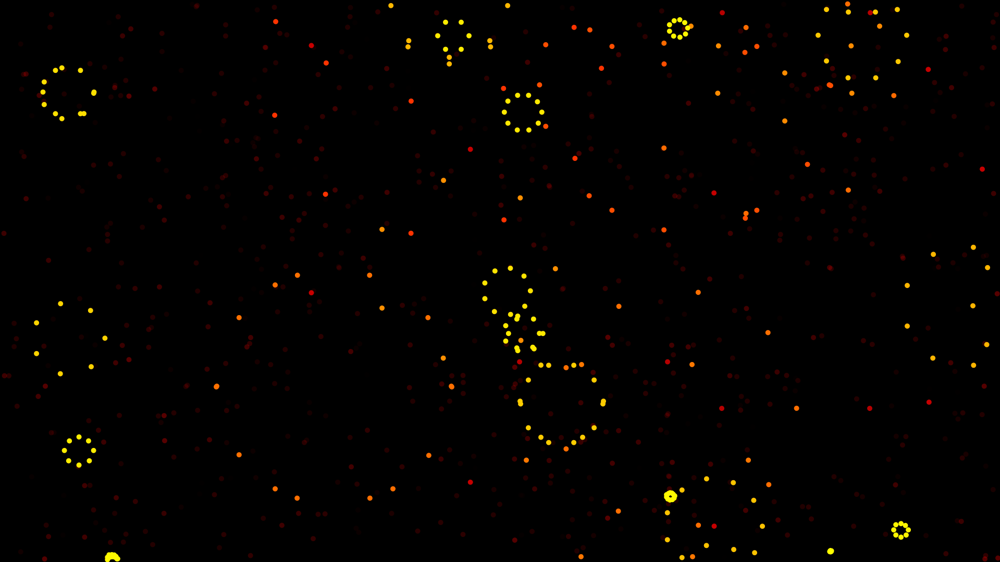

# Exploding stars

This is a browser animation in which stars 'explode' when they collide and thereby generate new stars.

New stars are yellow and slowly turn red, in which case they are ready to collide. After that they slowly fade away and finally disappear unless they explode before.

There is also a bound on the total number of stars so that the browser can render them without delay. The number of stars generated during an explosion is random.
